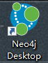
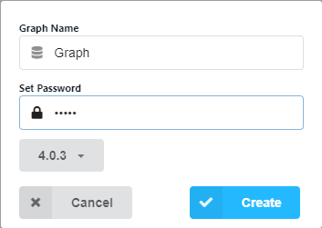
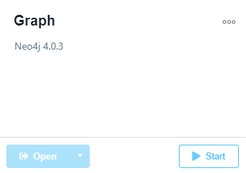
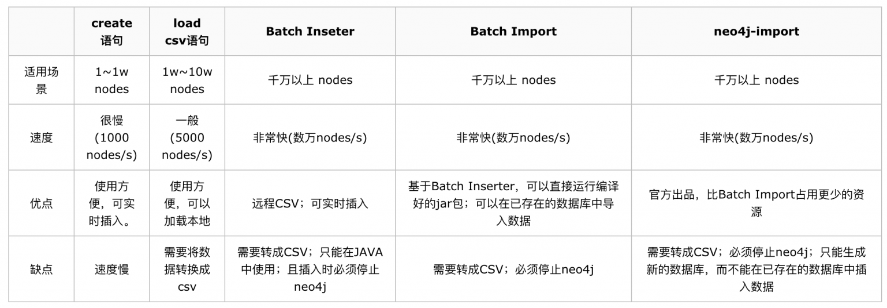
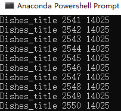
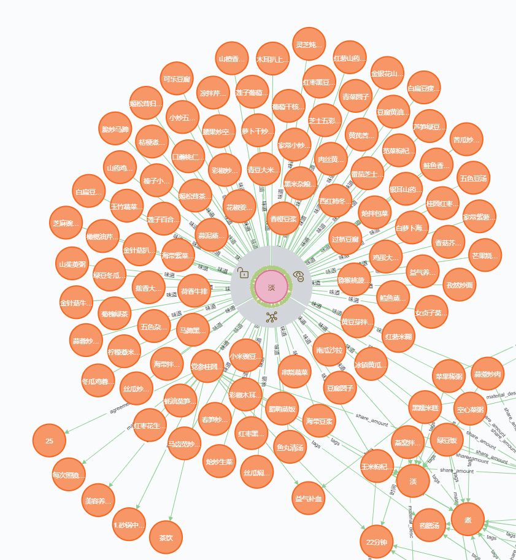
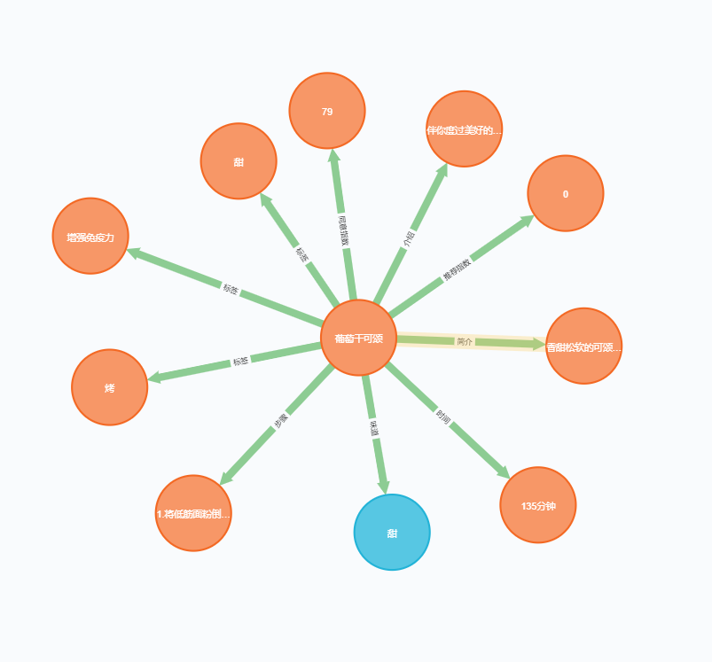

# 基于菜谱的数据 生成CVS 导入进Neo4j 数据库（以及一些坑）

爬取菜谱的数据文件构成

```bashrc

data/掌厨/
       ├──菜谱
       |    ├── 246
       |    |    └──CommentList.json             #评论 不用
       |    |    └──DishesCommensense.json       #关键食材和介绍
       |    |    └──DishesMaterial.json          #食材、材料
       |    |    └──DishesSuitable.json          #替代食材
       |    |    └──DishesView.json              #菜谱详细信息，菜名，时间，难度，步骤等
       |    |    └──RecommendLike.json           #相关菜
       |    ├── 248
       |    |    └──CommentList.json
       |    |    └──DishesCommensense.json
       |    |    └──DishesMaterial.json
       |    |    └──DishesSuitable.json
       |    |    └──DishesView.json
       |    |    └──RecommendLike.json
       |    └── ...                              #其他菜谱
       |
       ├──分类
       |    ├──3分钟小炒
       |    |       ├──炒饭
       |    |       |   └──1.json                #数种炒饭以上
       |    |       ├──炒面
       |    |       |   └──1.json
       |    |       └── ...                      #其他3分钟小炒
       |    |
       |    ├──地方特色菜
       |    |       ├──北京菜
       |    |       |    └──1.json
       |    |       └── ...                      #其他地方特色菜
       |    |
       |    └── ...  #其他分类
       |
       └──食材   
            ├──常见食材
            |    └── 菠菜
            |    |   └──1.json                   #相关菜
            |    |   └──2.json                   #相关菜
            |    |   └──3.json                   #相关菜
            |    |   └──菠菜.json                #该食材详细介绍
            |    |
            |    └── ...                         #其他常见食材
            |
            └── ...                              #其他食材
```
## 1.安装neo4j 数据库
[-**`下载链接`**](https://neo4j.com/download/)<br>

安装至任意盘

## 2.创建一个Graph 数据库
2.1. 打开桌面上的图标
<p align="left">
    
    </a>
</p>

2.2. 点击 `Add Database`

<p align="left">
    
    </a>
</p>

2.3. 点击 `Crete a Local Graph`,创建一个图数据库

<p align="left">
    
    </a>
</p>


2.4. 输入Name 和 Password, 一般默认Name 为Graph Password 为neo4j或者admin， 密码非常重要，链接数据库时需要密码

<p align="left">
    
    </a>
</p>

2.5. 启动Grph， 点击`Start`, 即启动完成

<p align="left">
    
    </a>
</p>

## 3.数据导入
<p align="left">
    
    </a>
</p>

经过对比，neo4j的官方命令`neo4j-import`最为强大，速度非常快。接下来我们使用两种方法导入数据：

1.使用Python 文件进行导入

**优点**：对于熟悉python的同学操作更容易理解

**缺点**：速度慢，其本质使用的是和表格中的`create`，经过测试，15,000个菜谱数据导入耗费2个小时左右。建议小规模数据使用

2.使用`neo4j-import`命令导入

**缺点**：步骤繁琐复杂,每一次导入需要情况数据库（即只能导入一次，没有找到追加的方法）

**优点**：速度快，相同的数据30秒导入完成

## 3.1 Python 导入

`知识图谱整理.py、build_medicalgraph.py`实施。该文件由刘焕勇老师[-**`QASystemOnMedicalKG`**](https://github.com/liuhuanyong/QASystemOnMedicalKG)修改而来。

### 3.1.1 生成json格式
先试用`知识图谱整理.py`将数据导入，生成一个字典，每行一个字典，将字典按行写入json文件中:
```bashrc
{"名称": "西式凤尾虾", "难度": "一般", "味道": "甜", "时间": "3分钟", "简介": "这道西式凤尾虾外型别致，带有一点小情调，给人带来惊喜，给平淡的生活增添一份精致。其实操作也非常简单，在家做一做，给心爱的人送上你的心意吧。", "推荐指数": "0", "介绍": "淡淡的情丝", "同意指数": "2543", "标签": ["拌", "厨师", "土豆", "益气补血", "虾"], "步骤": "1.洗净的生菜去梗，把菜叶切成丝。2.洗净的苹果去皮，去核，切瓣，切成小块。3.洗净的西红柿切瓣，切成小块。4.去皮洗净的土豆，切薄片，切成细丝。5.放入装有清水的碗中浸泡。6.将带尾洗净的虾仁切开背部，切断虾筋。7.虾仁加少许盐、味精、水淀粉拌匀，加少许吉士粉拌匀。8.撒上生粉，裹匀。9.热锅注油，烧至五成热，放入土豆丝，搅散。10.炸至金黄色捞出。11.锅中的油烧至五成热，倒入虾仁，炸约2分钟。12.将炸好的虾仁捞出。13.将苹果倒入碗中，加西红柿，再加沙拉酱、炼奶拌匀。14.把拌好的苹果、西红柿盛入盘中央，把生菜叶围在四周。15.取一小碗，加沙拉酱、炼奶拌匀。16.将炸好的虾仁裹上拌好的沙拉炼奶酱。17.再裹上炸好的土豆丝。18.摆盘即可。", "食材": "虾仁：150克;\n土豆：250克;\n苹果：50克;\n西红柿：50克;\n生菜：100克;\n盐：3克;\n水淀粉：10毫升;\n生粉：3克;\n味精：3克;\n沙拉酱：85克;\n炼奶：40克;\n食用油、吉士粉：各适量;\n", "关键食材介绍": "土豆富含糖类、蛋白质、脂肪、维生素和多种矿物质，性平味甘，具有和胃调中、益气健脾、强身益肾、消炎、活血消肿等功效，可辅助治疗消化不良、习惯性便秘、神疲乏力、慢性胃痛、关节疼痛、皮肤湿疹等症。", "提示": "切好的虾仁可以放到清水中清洗，以洗去虾筋。"}
{"名称": "奥尔良风味披萨", "难度": "一般", "味道": "咸", "时间": "85分钟", "简介": "美味的新奥尔良披萨，带着欧式的浪漫情怀，又有着新大陆的香辣口感，肉与蔬菜的完美搭配。", "推荐指数": "0", "介绍": "披萨的完美搭配", "同意指数": "1781", "标签": ["下午茶", "烤", "玉米", "咸", "披萨"], "步骤": "1.高筋面粉倒入案台上，用刮板开窝。2.加入水、白糖，搅匀。3.加入酵母、盐，搅匀。4.放入鸡蛋，搅散。5.刮入高筋面粉，混合均匀。6.倒入黄奶油，混匀。7.将混合物搓揉至纯滑面团。8.取一半面团，用擀面杖均匀擀成圆饼状面皮。9.将面皮放入披萨圆盘中，稍加修整，使面皮与披萨圆盘完整贴合。10.用叉子在面皮上均匀地扎出小孔。11.处理好的面皮放置常温下发酵1小时。12.发酵好的面皮上撒入玉米粒。13.加上洋葱丝。14.放入青椒粒、红彩椒粒。15.加入瘦肉丝。16.撒上芝士丁，披萨生坯制成。17.预热烤箱，温度调至上下火200℃。18.将装有披萨生坯的披萨圆盘放入预热好的烤箱中，烤10分钟至熟。19.取出烤好的披萨即可。", "食材": "披萨面皮部分：高筋面粉：200克;\n酵母：3克;\n黄奶油：20克;\n水：80毫升;\n盐：1克;\n白糖：10克;\n鸡蛋：1个;\n芝士丁：40克;\n馅料部分：瘦肉丝：50克;\n玉米粒：40克;\n青椒、红彩椒：各40克;\n洋葱丝：40克;\n工具：刮板、披萨圆盘：各1个;\n擀面杖：1根;\n叉子：1把;\n烤箱：1台;\n：;\n", "关键食材介绍": "青椒含有膳食纤维、维生素A、维生素C、辣椒素等营养成分，具有增进食欲、促进消化、增强免疫力等功效。", "提示": "瘦肉丝可以事先用调料腌渍一会儿，会使烤出的披萨味道更香。"}
{"名称": "黄桃培根披萨", "难度": "一般", "味道": "甜", "时间": "85分钟", "简介": "远渡重洋而来的培根，爱上了本土甜蜜的黄桃，这一定是最有浪漫味道的披萨。", "推荐指数": "0", "介绍": "浪漫的味道", "同意指数": "261", "标签": ["披萨", "甜", "烤", "下午茶", "补锌"], "步骤": "1.高筋面粉倒入案台上，用刮板开窝。2.加入水、白糖，搅匀。3.加入酵母、盐，搅匀。4.放入鸡蛋，搅散。5.刮入高筋面粉，混合均匀。6.倒入黄奶油，混匀。7.将混合物搓揉至纯滑面团。8.取一半面团，用擀面杖均匀擀成圆饼状面皮。9.将面皮放入披萨圆盘中，稍加修整，使面皮与披萨圆盘完整贴合。10.用叉子在面皮上均匀地扎出小孔。11.处理好的面皮放置常温下发酵1小时。12.发酵好的面皮上放入培根片。13.加入黄桃块。14.撒上洋葱丝。15.加入黄彩椒粒。16.放入红彩椒粒。17.放入红彩椒粒。18.刷上沙拉酱。19.撒上芝士丁，披萨生坯制成。20.预热烤箱，温度调至上下火200℃。21.将装有披萨生坯的披萨圆盘放入预热好的烤箱中，烤10分钟至熟。22.取出烤好的披萨即可。", "食材": "披萨面皮部分：高筋面粉：200克;\n酵母：3克;\n黄奶油：20克;\n水：80毫升;\n盐：1克;\n白糖：10克;\n鸡蛋：1个;\n芝士丁：40克;\n馅料部分：黄桃块：80克;\n培根片：50克;\n黄彩椒粒、红彩椒粒、青椒粒：各40克;\n洋葱丝：30克;\n沙拉酱：20克;\n工具：刮板、披萨圆盘：各1个;\n擀面杖：1根;\n叉子：1把;\n烤箱：1台;\n：;\n", "关键食材介绍": "黄桃含有膳食纤维、果胶、硒、锌、铁，以及多种维生素等营养物质，具有通便润肠、促进食欲、调节人体新陈代谢、提高免疫力等作用。", "提示": "可依个人喜好，适当增加沙拉酱的用量。"}
...
``` 

### 3.1.2 `build_medicalgraph.py`修改
注意：要保持数据库始终属于开启状态

16-20行是Python 进入 数据库的参数配置
```bashrc
host="localhost",  # neo4j 搭载服务器的ip地址，ifconfig可获取到，本地数据库只开启一个的话一般为localhost
http_port=7474,  # neo4j 服务器监听的端口号，一般都为7474
user="neo4j",  # 数据库user name，如果没有更改过，应该是neo4j
password="" #使用自己的密码
``` 

#### 3.1.2.1 read_nodes 修改

字典中有多少个`key`，就构建多少个空`list`。如有一些没用的`key`，可以舍弃，构建节点看自己数据定义。以及一个储存所有信息的`list`：`all_infos`

再接着构建 **关系**`list`，这里面构建了(结点 - 1) 个个关系。比如有17个节点，构建了16个关系；比如`菜名 - 难度 的关系`


65行为逐行添加信息，循环中构建一个空字典，循坏结束时将字典添加进入`all_infos`的list中

如果一类关系是一对多的关系，比如`"标签": ["披萨", "甜", "烤", "下午茶", "补锌"]`，那么需要使用for loop加入关系
```bashrc
if '标签' in data_json: #如需替换，需要把'标签'替换掉其他关键词
    tags += data_json['标签'] #如需替换，需要把'标签'替换掉其他关键词
                
for tag in data_json['标签']: #如需替换，需要把'标签，tag'替换掉其他关键词
    rels_tags.append([name_dishes,tag])  #如需替换，需要把'rels_tags，tag'替换掉其他关键词
disease_dict['tags'] =  data_json['标签'] #如需替换，需要把'标签，tag'替换掉其他关键词
```  

如果是一对一的关系，就比较方便：
```bashrc
if '味道' in data_json:
    taste += [data_json['味道']]
    disease_dict['taste'] = data_json['味道']
    rels_taste.append([name_dishes, data_json['味道']])
```

返回上面构建的所有list，一个也不能落下。其中节点使用set保证唯一性

#### 3.1.2.2 create_node 
无需修改

#### 3.1.2.3 create_dishes_nodes 构建初始节点
这里修改了变量名，由`create_diseases_nodes`修改而来

Node 的关键名字由"Disease"变成"Name"或者你想要的名字

剩下的为 key = disease_dict[key]，key为你在read_nodes中字典的关键词。比如：`hard_level=disease_dict['hard_level']`。

#### 3.1.2.4 create_graphnodes 构建节点
第一行，使用`read_nodes()`函数。因为返回的list数量很多，需要数清楚对应的返回的变量，节点名称的首字母大写

create_dishes_nodes（disease_infos） 变成你构建的字典名称 create_dishes_nodes(all_infos) 

然后接下来以此添加修改节点名称。

#### 3.1.2.5 create_graphrels 构建关系
```bashrc
self.create_relationship('Dashes_name', 'Hard_level', rels_hard_level, 'hard_level', '难度')
```
第一个值为出发节点（实体），第二个值为到达节点（值），第三个值为关系表达式，read_nodes中的rels_xx_xx，第四、五个位关系（属性）名称，可以只保留一个

这里用两个在可视化中可以选择英文或者中文,即`create_relationship('Dashes_name', 'Hard_level', rels_hard_level,  '难度')`是可行的。

#### 3.1.2.6 create_relationship
无需修改

#### 3.1.2.7 others
测试查找用，可不用

#### 3.1.2.8 export_data
生成txt文件，可不用

### 3.1.3 命令行导入数据
`cd` 到`build_medicalgraph.py`所在目录下，启动`python build_medicalgraph.py`
<p align="left">
    
    </a>
</p>
在Powershell中会显示正在导入的节点和关系进程，即表示正在导入


## 3.2 neo4j-import 导入
该步骤有官方[教程](https://neo4j.com/docs/operations-manual/current/tutorial/import-tool/),但略简单，可作为测试使用。

### 3.2.1 准备工作
在此之前，需要对计算机安装[java 11](https://www.oracle.com/java/technologies/javase-jdk11-downloads.html)，Windows下安装完成即可，暂不用输入进环境变量中。注意版本必须是java 11 或以上，低版本不支持，会出现`Could not find java at C:\Program Files (x86)\Java\jdk1.8.0_181\bin\java.exe`等错误。[java 11安装教程](https://blog.csdn.net/weixin_40928253/article/details/83590136)

### 3.2.2 准备csv文档
`知识图谱整理.py`实施

参考官方教程，节点的csv文档必须有三组数据：`nodeID:ID，node_name，:LABEL`;关系csv中必须有这四种数据：`:START_ID，role，:END_ID，:TYPE`；官方数据如下：
```bashrc
  movieId:ID                   title  year:int        :LABEL
0  tt0133093              The Matrix      1999         Movie
1  tt0234215     The Matrix Reloaded      2003  Movie;Sequel
2  tt0242653  The Matrix Revolutions      2003  Movie;Sequel

  personId:ID                name :LABEL
0       keanu        Keanu Reeves  Actor
1     laurenc  Laurence Fishburne  Actor
2  carrieanne    Carrie-Anne Moss  Actor

    :START_ID      role    :END_ID     :TYPE
0       keanu       Neo  tt0133093  ACTED_IN
1       keanu       Neo  tt0234215  ACTED_IN
2       keanu       Neo  tt0242653  ACTED_IN
3     laurenc  Morpheus  tt0133093  ACTED_IN
4     laurenc  Morpheus  tt0234215  ACTED_IN
5     laurenc  Morpheus  tt0242653  ACTED_IN
6  carrieanne   Trinity  tt0133093  ACTED_IN
7  carrieanne   Trinity  tt0234215  ACTED_IN
8  carrieanne   Trinity  tt0242653  ACTED_IN
```

按照该要求，需要用`sklearn`中的`LabelEncoder`对他们进行编码，为了使其ID不唯一，对第二组的`nodes`的`value_id`全部加上100000，然后生成两个节点csv文件和一个关系csv文件，csv必须使用`utf-8`进行编码。生成数据如下：
```bashrc
        entity_id:ID        entity         :LABEL
0              10872      西式凤尾虾          Name
1               2106    奥尔良风味披萨        Name
                 ...         ...               ...
439492          3621    杂粮阳光三明治         Name
439493          3446      早餐三明治          Name
 
        value_id:ID       value          :LABEL
0           1017630        一般           难度
1           1017630        一般           难度
            ...             ...           ...
439492      1041231       早餐三明治      相关菜
439493      1041231       早餐三明治      相关菜

        :START_ID       role  :     END_ID :    TYPE
0           10872    西式凤尾虾     1017630      难度
1            2106  奥尔良风味披萨    1017630      难度
               ...      ...         ....        ...    
439492       3621  杂粮阳光三明治   1041231      相关菜
439493       3446    早餐三明治     1041231      相关菜
```

### 3.2.3 放置csv文件
回到Neo4j Desktop,关闭数据库，使其处于停止状态。并确保该数据库为空数据库，0 Nodes，0 relationships；
<p align="left">
    
    </a>
</p>

找到Neo4j Desktop的安装路径，将三个csv文件放入`import`目录下，就代表文件放置工作完成。
```bashrc

../Neo4j_Desktop/neo4jDatabases/database-xxxx-xxxx-xxxx/installation-4.0.3/
                                                               ├── import(原本该文件夹为空，后将把csv文件放置该目录下)
                                                               |     └──nodes_xxx_1.csv(movies.csv)
                                                               |     └──nodes_xxx_2.csv(actors.csv)
                                                               |     └──relationships_xxx.csv()
                                                               ├── data
                                                               |     └──databases(每次执行确保该文件夹是空的)
                                                               |     └──dbms(不用管)
                                                               |     └──transactions(每次执行确保该文件夹是空的)
                                                               ├── bin
                                                               |
                                                               └── ...
                                                               
      
```

### 3.2.4 import csv文件进入数据库
打开`cmd`，`cd`到`installation-4.0.3/bin`目录下(注意，如果文件在其他盘，则需要加`/`，如：`cd /d d:`).

启动命令`neo4j-admin import --nodes=../import/movies.csv --nodes=../import/actors.csv --relationships=../import/roles.csv --multiline-fields=True --skip-duplicate-nodes=True`

或者`neo4j-admin import --nodes=../import/node1.csv --nodes=../import/node2.csv --relationships=../import/relations.csv --multiline-fields=True --skip-duplicate-nodes=True`


注意，因为csv有重复值，必须使用`--skip-duplicate-nodes=True`，更多的参数设置，参考[官方](https://neo4j.com/docs/operations-manual/current/tools/import/options/)，中文翻译参考[这里](http://weikeqin.com/2017/04/11/neo4j-import/)

## 效果展示
<p align="center">
    
    </a>
</p>

<p align="center">
    
    </a>
</p>


如果需要该数据，请联系ethanliuzhuo@outlook.com
